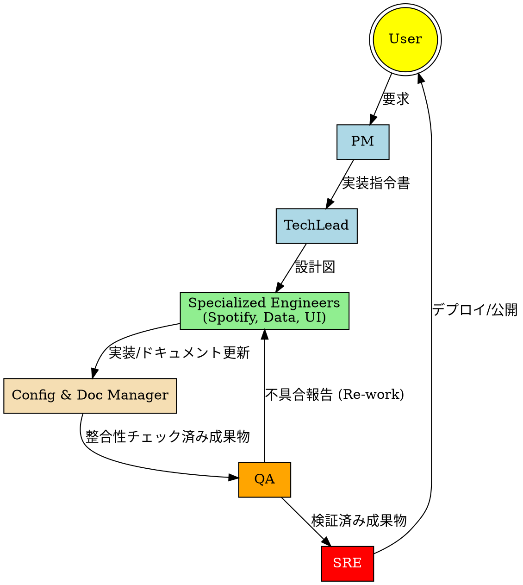

# Project Workflow: The Orchestration Loop

本プロジェクトにおけるマルチエージェント間の連携と、タスク完了までのプロセスを定義する。

## 1. ワークフロー概要図

## 2. フェーズ別詳細

### Phase 1: Planning & Design
1. **PM** が要求を分解し、`task_id` を発行。
2. **Tech Lead** がデータモデルとインターフェースを確定させ、`affected_files` をリストアップ。
3. **Doc Manager** が設計ドキュメントを更新し、全エージェントに通知。

### Phase 2: Implementation (Parallel)
1. **Spotify Engineer** がAPI認可と楽曲同期を実装。
2. **Data Engineer** が同期されたデータに基づき、マッピング・グラフ計算ロジックを実装。
3. **UI Engineer** が計算結果を視覚化するコンポーネントを開発。
4. **Config Manager** が依存関係とブランチの状態を常に監視。

### Phase 3: Validation & Quality
1. **QA** が単体・結合テストを実行。特に「Spotify APIのエラーハンドリング」と「マッピング計算の境界値」を重点チェック。
2. 不具合があれば、該当エンジニアへ I/O スキーマに基づいたフィードバックを行う。

### Phase 4: Delivery & Operations
1. **SRE** が Vercel へのデプロイを実行。
2. パフォーマンスモニタリングを開始し、ボトルネックがあれば **Tech Lead** へ改善を提案。

## 3. エントロピー抑制ルール
- **Handoffの厳守**: エージェント間の受け渡しは必ず定義された JSON スキーマ、または構造化された Markdown 形式で行う。
- **コンテキストの最小化**: 各フェーズで、エージェントは自分に関係のないドキュメントを読み込まない（Doc Managerがフィルタリングする）。
- **ループの防止**: 同じ理由での差し戻しが3回以上発生した場合、**PM** が介入し仕様を再定義する。
